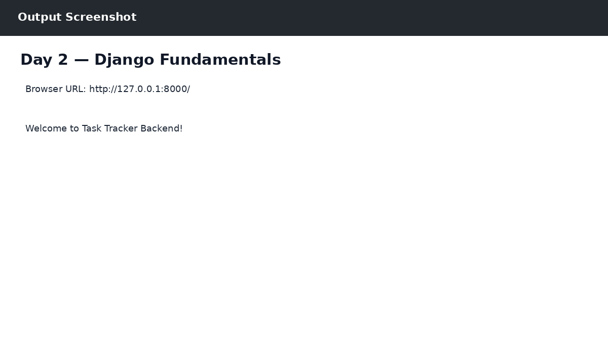

# Day 2 — Django Fundamentals

## Objective
Created the Django project and tasks app, configured URLs and a home view.

## Work Completed
- Project: tasktracker
- App: tasks
- Created a home view and connected it through tasks/urls.py and project urls.py.
- System check completed successfully.

## Output

The output reference is shown below:

## Technologies
- Python 3.14.0
- Django 6.1.1
- SQLite
- Postman
- React / JavaScript (where applicable)
- Git & GitHub

## Result
Day 2 work was completed successfully as part of the ZoyaSofts Week 4 Python Backend & Django Fundamentals training.
