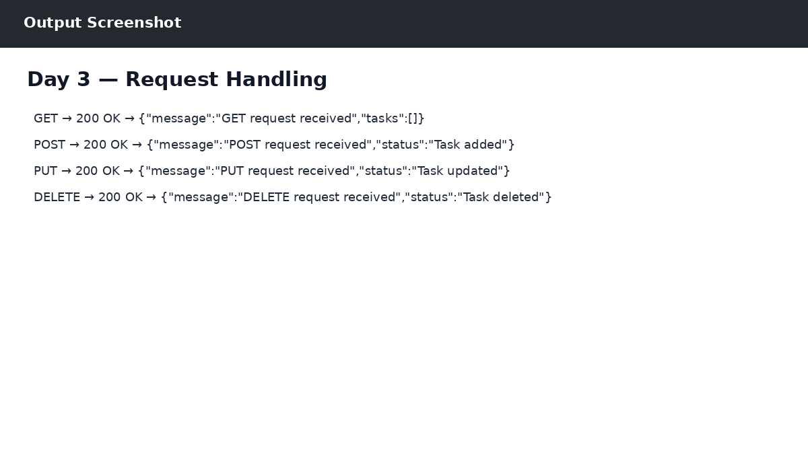

# Day 3 — Request Handling

## Objective
Practiced GET, POST, PUT and DELETE requests using Django and Postman.

## Work Completed
- GET: received task list response.
- POST: Task added.
- PUT: Task updated.
- DELETE: Task deleted.
- CSRF was handled for the practice API with @csrf_exempt.

## Output

The output reference is shown below:

## Technologies
- Python 3.14.0
- Django 6.1.1
- SQLite
- Postman
- React / JavaScript (where applicable)
- Git & GitHub

## Result
Day 3 work was completed successfully as part of the ZoyaSofts Week 4 Python Backend & Django Fundamentals training.
