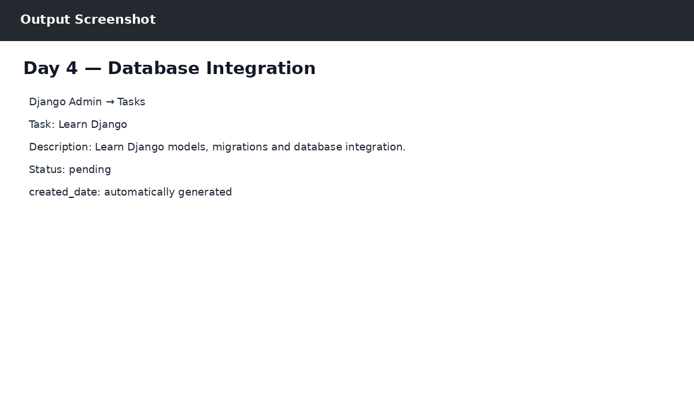

# Day 4 — Database Integration

## Objective
Created the Task model, migrations, SQLite database integration and Django Admin setup.

## Work Completed
- Task fields: task_name, description, status, created_date
- Migrations created and applied successfully.
- Registered Task in Django Admin.
- Added sample task: Learn Django.

## Output

The output reference is shown below:

## Technologies
- Python 3.14.0
- Django 6.1.1
- SQLite
- Postman
- React / JavaScript (where applicable)
- Git & GitHub

## Result
Day 4 work was completed successfully as part of the ZoyaSofts Week 4 Python Backend & Django Fundamentals training.
