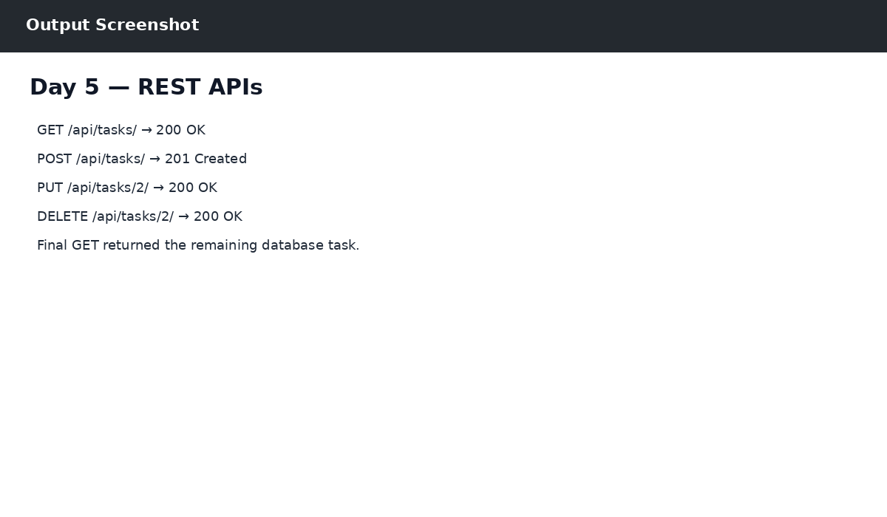

# Day 5 — REST APIs

## Objective
Built database-backed CRUD REST API endpoints returning JSON responses.

## Work Completed
- GET /api/tasks/ — list all tasks
- POST /api/tasks/ — create a task
- PUT /api/tasks/<id>/ — update a task
- DELETE /api/tasks/<id>/ — delete a task
- Tested endpoints in Postman.

## Output

The output reference is shown below:

## Technologies
- Python 3.14.0
- Django 6.1.1
- SQLite
- Postman
- React / JavaScript (where applicable)
- Git & GitHub

## Result
Day 5 work was completed successfully as part of the ZoyaSofts Week 4 Python Backend & Django Fundamentals training.
