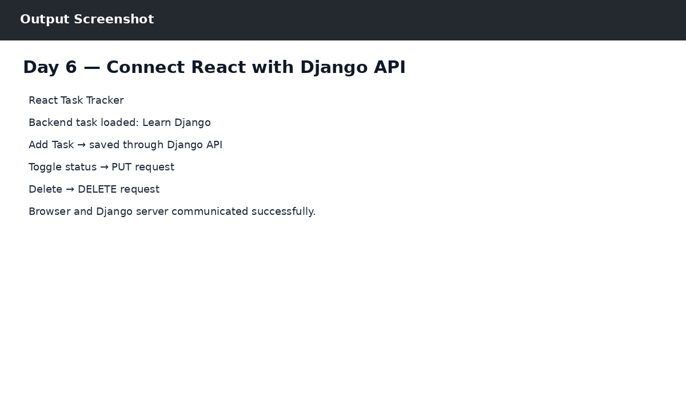

# Day 6 — Connect React with Django API

## Objective
Connected the Week 2 React Task Tracker UI to the Django backend using fetch().

## Work Completed
- React uses GET to load tasks from Django.
- POST adds new tasks to the Django database.
- PUT changes task status.
- DELETE removes tasks.
- django-cors-headers was configured for frontend/backend communication.

## Output

The output reference is shown below:

## Technologies
- Python 3.14.0
- Django 6.1.1
- SQLite
- Postman
- React / JavaScript (where applicable)
- Git & GitHub

## Result
Day 6 work was completed successfully as part of the ZoyaSofts Week 4 Python Backend & Django Fundamentals training.
