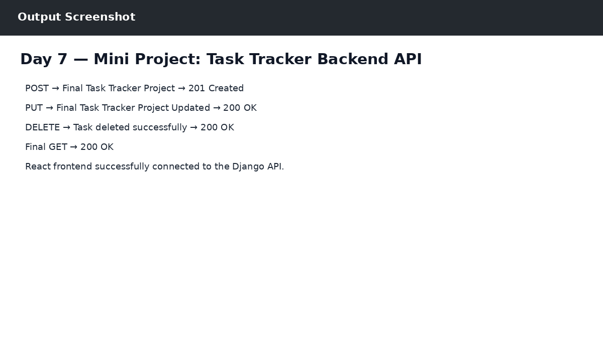

# Day 7 — Mini Project: Task Tracker Backend API

## Objective
Completed the final Django Task Tracker backend with database, CRUD APIs, Postman testing and React connection.

## Work Completed
- Final project combines Days 1–6.
- Technology: Python, Django, SQLite, React, JavaScript, Fetch API, Postman.
- Task model and CRUD API are working.
- Final CRUD test was completed successfully.

## Output

The output reference is shown below:

## Technologies
- Python 3.14.0
- Django 6.1.1
- SQLite
- Postman
- React / JavaScript (where applicable)
- Git & GitHub

## Result
Day 7 work was completed successfully as part of the ZoyaSofts Week 4 Python Backend & Django Fundamentals training.
